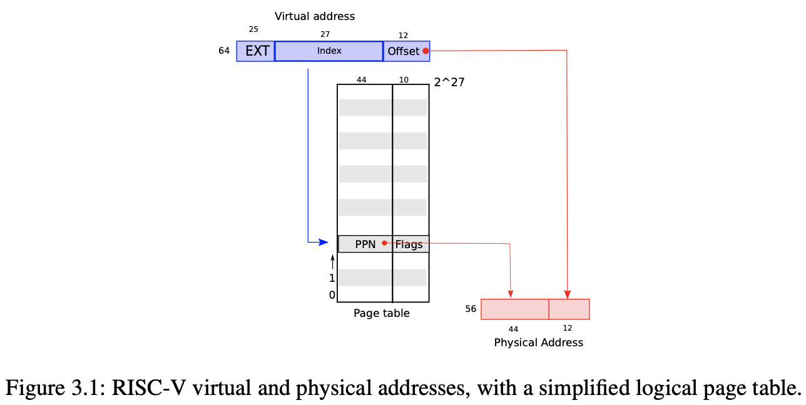
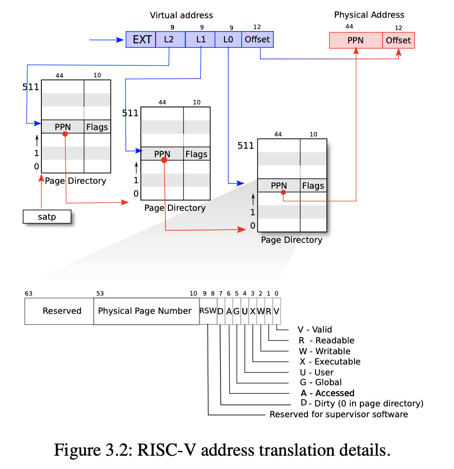
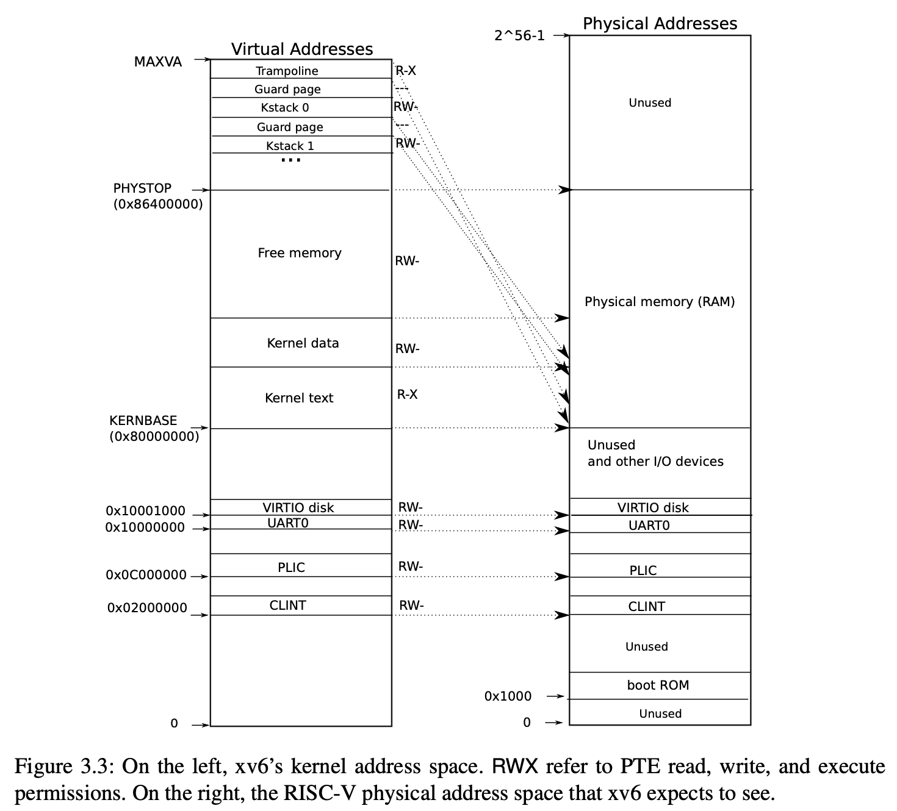
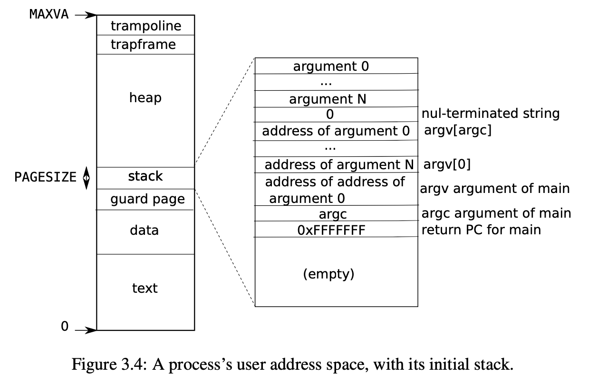

# Note: xv6 book Chapter 3

参考资料：[xv6 book](https://pdos.csail.mit.edu/6.S081/2020/xv6/book-riscv-rev1.pdf), https://zhuanlan.zhihu.com/p/351646541


## Paging hardware

RISC-V 指令是对虚拟地址操作的，而物理内存是由物理地址索引的，RISC-V 页表存储虚拟地址到物理地址的映射。

xv6 是基于 Sv39 RISC-V 的，这意味着 64 位虚拟地址只有低 39 位是被使用的。一个 RISC-V 页表是一个包含 $2^{27}$ 个页表项（PTE）的数组，每个 PTE 包含 44 位的物理页号（PPN）和 10 位的 flags（但实际上用 64 位 8 字节的 uint64 存储，只用了其中 54 位而已）。虚拟地址 39 位中的高 27 位用作页表的索引找物理页号，低 12 位作为页内偏移，如图 3.1 所示。这样的页表允许操作系统**以页（4096 B）为单位**控制虚拟地址到物理地址的转换。



图 3.2 是更详细的描述，可以看见，事实上页表在**物理内存**中存储为 **3 级树形结构**：satp 寄存器指向树根处的页表，根据 L2 在该页表中找到下一级页表的开始地址，根据 L1 在该页表找到再下一级页表的开始地址，最后根据 L0 在该页表中找到真正的物理地址。如果这 3 级查找中任何一级 PTE 不存在，则抛出 page-fault exception，然后内核处理该异常。在该结构下，一个页表有 512 项，每个页表项 8 字节，所以**一个页表正好是一页的大小**。常见情况下大量的虚拟地址都不被使用，这种 3 级结构让我们不必存储所有页表。



每一个 PTE 包含一些 flag bits：

- PTE_V 表示该 PTE 是否有效，如果无效，访问它将导致异常；
- PTE_R 表示是否允许指令读它指向的那一页；
- PTE_W 表示是否允许指令写它指向的那一页；
- PTE_X 表示是否允许 CPU 将它指向的那一页的内容翻译为指令并执行；
- PTE_U 表示是否允许 user mode 的指令访问它指向的那一页，如果没有置位，则只能在 supervised mode 下访问；

所有 flags 和相关数据结构都在 kernel/riscv.h 中定义。

每一个 CPU 都有一个 satp 寄存器，根据自己的 satp 进行虚拟地址的转换，所以不同 CPU 看到的进程虚拟内存视图是不同的，有着各自的虚拟地址空间。


## Kernel address space

在 xv6 中，每一个进程都会有一个页表，描述这个进程的**用户地址空间**，另外还有一个页表描述**内核地址空间**。内核的地址映射基本都是直接映射，如图 3.3 所示：



可以看见，QEMU 模拟的计算机的内存从 0x80000000 (KERNBASE) 开始，到 0x86400000 (PHYSTOP) 结束，一共 64MB。（但事实上，kernel/memlayout.h 中定义 `PHYSTOP=KERNBASE+128*1024*1024`，所以其实有 128MB）。0x80000000 以下是 I/O 设备；PHYSTOP 以上物理内存是无效的，可以通过新增 DRAM 芯片扩展内存空间。

有几个内核虚拟地址并不是直接映射的：

- The trampoline page：在虚拟地址空间的最顶端（用户页表也是这样的），在第 4 章介绍这一页的作用。由此可以知道虚拟地址到物理地址的映射可以是多对一的。
- The kernel stack pages：每一个进程都有一个 kernel stack，当进程在内核态下执行指令时用内核栈。它们处于虚拟地址的顶端且搭配有 guard page。guard page 是不能访问的（PTE_V 无效），因此这样可以防止栈溢出。可以看见如此设计 kernel stack 也是多对一的，如果采用只有直接映射的设计，guard page 就会浪费一些物理内存。


## Code: creating an address space

首先看 kernel/riscv.h 中的宏定义：

```c
#define PGSIZE 4096 // bytes per page
#define PGSHIFT 12  // bits of offset within a page
#define PGROUNDUP(sz)  (((sz)+PGSIZE-1) & ~(PGSIZE-1))
#define PGROUNDDOWN(a) (((a)) & ~(PGSIZE-1))
#define PTE_V (1L << 0) // valid
#define PTE_R (1L << 1)
#define PTE_W (1L << 2)
#define PTE_X (1L << 3)
#define PTE_U (1L << 4) // 1 -> user can access
// shift a physical address to the right place for a PTE.
#define PA2PTE(pa) ((((uint64)pa) >> 12) << 10)
#define PTE2PA(pte) (((pte) >> 10) << 12)
#define PTE_FLAGS(pte) ((pte) & 0x3FF)
// extract the three 9-bit page table indices from a virtual address.
#define PXMASK          0x1FF // 9 bits
#define PXSHIFT(level)  (PGSHIFT+(9*(level)))
#define PX(level, va) ((((uint64) (va)) >> PXSHIFT(level)) & PXMASK)
// one beyond the highest possible virtual address.
// MAXVA is actually one bit less than the max allowed by
// Sv39, to avoid having to sign-extend virtual addresses
// that have the high bit set.
#define MAXVA (1L << (9 + 9 + 9 + 12 - 1))
typedef uint64 pte_t;
typedef uint64 *pagetable_t; // 512 PTEs
```

- 核心数据结构是 `pagetable_t`，本质就是一个指针 uint64 *，指向 RISC-V 的根页表，可以是内核页表，也可以是用户进程的页表。
- 页表项 `pte_t` 本质就是一个 uint64，`(pte)>>10` 是物理页号，`((pte)>>10)<<12` 是物理页的首地址，所以 `PTE2PA` 的作用是将一条 pte 翻译成对应物理页的首地址；`PA2PTE` 反之；`PTE_FLAGS` 的作用是将后 10 位 flags 捞出来。
- `PX(level, va)` 宏定义的作用是捞出虚拟地址中对应 level 层的那 9 位，见图 3.2。
- `PTE_V` 等标志位宏定义可以用来置位。
- `PGROUNDUP` 和`PGROUNDDOWN` 用来找到某一地址的页基址，实现很简单，把地址的后 12 位页内偏移置零即可。

xv6 操作地址空间和页表的大多数代码都在 kernel/vm.c 之中：

- 核心函数 walk 用于在给定页表 pagetable 中找到某一虚拟地址 va 对应的 PTE 地址，它在图 3.2 所示的页表 3 级树形结构中搜索。另外，如果参数 alloc 不为 0，则在查找的页表不存在时创建之。

  ```c
  // Return the address of the PTE in page table pagetable
  // that corresponds to virtual address va.  If alloc!=0,
  // create any required page-table pages.
  //
  // The risc-v Sv39 scheme has three levels of page-table
  // pages. A page-table page contains 512 64-bit PTEs.
  // A 64-bit virtual address is split into five fields:
  //   39..63 -- must be zero.
  //   30..38 -- 9 bits of level-2 index.
  //   21..29 -- 9 bits of level-1 index.
  //   12..20 -- 9 bits of level-0 index.
  //    0..11 -- 12 bits of byte offset within the page.
  pte_t *
  walk(pagetable_t pagetable, uint64 va, int alloc)
  {
    if(va >= MAXVA)
      panic("walk");
  
    for(int level = 2; level > 0; level--) {
      pte_t *pte = &pagetable[PX(level, va)];
      if(*pte & PTE_V) {
        pagetable = (pagetable_t)PTE2PA(*pte);
      } else {
        if(!alloc || (pagetable = (pde_t*)kalloc()) == 0)
          return 0;
        memset(pagetable, 0, PGSIZE);
        *pte = PA2PTE(pagetable) | PTE_V;
      }
    }
    return &pagetable[PX(0, va)];
  }
  ```

  代码应该还是容易看懂的，根据基址 `pagetable` 和偏移 `PX(level, va)` 找到 pte，如果存在该 pte 则转换为物理地址 `PTE2PA` 作为下一级页表的基址，否则如果 alloc 非 0，申请一页的内存，分配空间（即创建一个页表），填写该中间节点页表的页表项。

  **注意 walk 并没有给叶子结点的 PTE 填充内容，只是找到了它的地址而已，填充内容用下面的 mappages 函数。**

- 核心函数 mappages 为新的映射创建 PTE。

  ```c
  // Create PTEs for virtual addresses starting at va that refer to
  // physical addresses starting at pa. va and size might not
  // be page-aligned. Returns 0 on success, -1 if walk() couldn't
  // allocate a needed page-table page.
  int
  mappages(pagetable_t pagetable, uint64 va, uint64 size, uint64 pa, int perm)
  {
    uint64 a, last;
    pte_t *pte;
  
    a = PGROUNDDOWN(va);
    last = PGROUNDDOWN(va + size - 1);
    for(;;){
      if((pte = walk(pagetable, a, 1)) == 0)
        return -1;
      if(*pte & PTE_V)
        panic("remap");
      *pte = PA2PTE(pa) | perm | PTE_V;
      if(a == last)
        break;
      a += PGSIZE;
      pa += PGSIZE;
    }
    return 0;
  }
  ```

  由于 va 和 size 不一定和页的大小对齐，但是操作系统只能**以页为单位**操作页表，所以要先找到开头 va 和结束 va+size-1 所在的页基址 `a` 和 `last`。对于这个范围中的每一页，用 walk 函数找到其 pte ，填上物理地址和标志位。

- 其余函数中，以 kvm 开头的函数操纵内核页表，以 uvm 开头的函数操作用户页表，其他函数通用。上一个实验接触到了 copyout，给定一个用户的虚拟地址，把数据复制到该地址中；copyin 相反，把用户虚拟地址指向的数据复制下来（注意我们现在是站在内核的角度）。详细分析在用到的时候再说。

<br>

在内核启动阶段，kernel/main.c 会调用 kvminit 创建内核页表：

```c
/*
 * create a direct-map page table for the kernel.
 */
void
kvminit()
{
  kernel_pagetable = (pagetable_t) kalloc();
  memset(kernel_pagetable, 0, PGSIZE);
  // uart registers
  kvmmap(UART0, UART0, PGSIZE, PTE_R | PTE_W);
  // virtio mmio disk interface
  kvmmap(VIRTIO0, VIRTIO0, PGSIZE, PTE_R | PTE_W);
  // CLINT
  kvmmap(CLINT, CLINT, 0x10000, PTE_R | PTE_W);
  // PLIC
  kvmmap(PLIC, PLIC, 0x400000, PTE_R | PTE_W);
  // map kernel text executable and read-only.
  kvmmap(KERNBASE, KERNBASE, (uint64)etext-KERNBASE, PTE_R | PTE_X);
  // map kernel data and the physical RAM we'll make use of.
  kvmmap((uint64)etext, (uint64)etext, PHYSTOP-(uint64)etext, PTE_R | PTE_W);
  // map the trampoline for trap entry/exit to
  // the highest virtual address in the kernel.
  kvmmap(TRAMPOLINE, (uint64)trampoline, PGSIZE, PTE_R | PTE_X);
}

// add a mapping to the kernel page table.
// only used when booting.
// does not flush TLB or enable paging.
void
kvmmap(uint64 va, uint64 pa, uint64 sz, int perm)
{
  if(mappages(kernel_pagetable, va, sz, pa, perm) != 0)
    panic("kvmmap");
}
```

`kvmmap` 只是对 `mappages` 的封装罢了——为内核页表创建并填充 PTE，`kvminit` 反复调用了一堆，其实就是把图 3.3 建立出来（除了 kernel stack 暂时没有）。

调用 kvminit 之后内核页表已经建立好了，main.c 调用 kvminithart 装载内核页表，所谓装载，其实就是设置 satp 寄存器和刷新 TLB：

```c
// Switch h/w page table register to the kernel's page table,
// and enable paging.
void
kvminithart()
{
  w_satp(MAKE_SATP(kernel_pagetable));
  sfence_vma();
}
```

在改动了页表之后用 sfence_vma 刷新 TLB 是必要的，否则 CPU 在 TLB 中缓存的 PTE 可能过时了，导致取得错误的结果。

还记得刚才没有建立 kernel stack 吗？现在 main.c 调用 procinit (kernel/proc.c)，为每一个进程分配一个 kernel stack：

```c
// initialize the proc table at boot time.
void
procinit(void)
{
  struct proc *p;

  initlock(&pid_lock, "nextpid");
  for(p = proc; p < &proc[NPROC]; p++) {
      initlock(&p->lock, "proc");

      // Allocate a page for the process's kernel stack.
      // Map it high in memory, followed by an invalid
      // guard page.
      char *pa = kalloc();
      if(pa == 0)
        panic("kalloc");
      uint64 va = KSTACK((int) (p - proc));
      kvmmap(va, (uint64)pa, PGSIZE, PTE_R | PTE_W);
      p->kstack = va;
  }
  kvminithart();
}
```

正如图 3.3 所示，kernel stack 在内核虚拟地址的高地址部分。分配时 `KSTACK` 宏一次性跳 2 个 PGSIZE，我们只设置其中一个，另一个自然就变成了 guard page。最后再次调用 kvminithart 重新加载 satp 并刷新 TLB。


## Physical memory allocation

上一个实验计算空闲内存时我们已经看到了 xv6 的内存分配机制。从 kernel 结束的位置到 PHYSTOP 都是可以分配的内存，每次分配或释放都是一整页 4KB，空闲页由一个链表 kmem->freelist 维护。相关代码已经在上一个实验中看过了，此不赘述。


## Process address space

上文和上个实验都说了，每个进程都有一个页表描述用户地址空间，这与内核的页表是不同的。用户地址空间从 0 开始到 MAXVA (kernel/riscv.h)，一共 256GB。当一个进程申请内存空间时，xv6 调用 kalloc 分配物理页，然后添加 PTE 到进程的页表中，且所有 PTE 的 PTE_W, PTE_X, PTE_R, PTE_U 和 PTE_V 都被置位。



图 3.4 是用户虚拟空间内存的布局，其中用户栈 user stack 是一个页，初始内容由 exec 系统调用产生（因为我们执行一个用户程序，其实是 shell 调用了 exec 执行的）。用户栈的内容设置好之后就开始执行用户程序的 main 函数。

用户栈下面也有一页的 guard page，如果用户程序访问了它，则会导致 page-fault exception。

