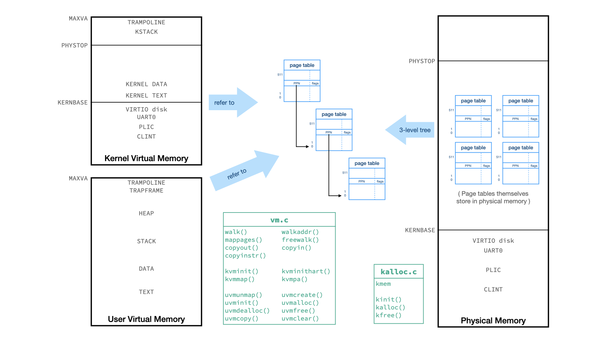
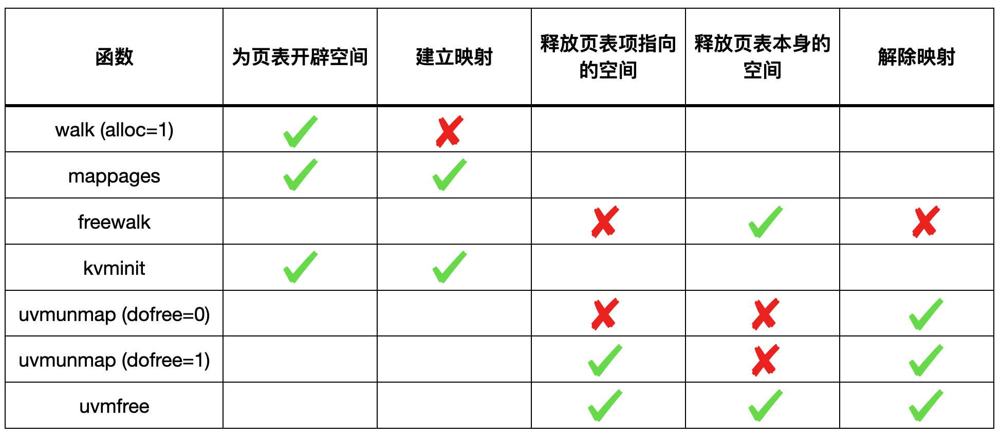

# Lab: page tables

https://pdos.csail.mit.edu/6.S081/2020/labs/pgtbl.html

<br>

做这次实验需要对 xv6 的页表机制和代码有**深刻**的理解，必须先阅读 xv6 book 的第三章，详见笔记（主分支下 Note 文件夹）。

为了更形象的理解，我画了一张图：



首先要明白的一点是，页表本身也是在内存中的，也是需要内存空间的，所以**给页表开辟空间**和**建立映射（填写页表项）**是两码事，同样的，**释放页表项指向的空间**、**释放页表本身占有的空间**、**解除映射（页表项清零）**也是不同的事儿。

其次，xv6 代码中只有 kalloc.c 是对物理内存进行直接管理的代码，要真正分配、释放内存空间，最底层一定是调用 kalloc() 或 kfree() 实现的。

最后，vm.c 正如其名，是管理虚拟内存的代码，包括（加粗重点）：

- **walk**：在指定的页表中找到 pte 地址，若设置了 alloc 参数，可以**为页表开辟内存空间**（但是 walk 不会给叶子结点的页表项填写内容，即**不会建立映射**）；
- **mappages**：**建立映射**，如果页表本身不存在会先开辟空间，要求原本没有映射；
- **freewalk**：**释放页表本身**，要求所有映射已经被解除（页表项全部已经清零）；
- walkaddr：在指定的用户页表中找虚拟地址对应的物理地址，如果页表不存在/映射不存在返回 0；


- **kvminit**：创建初始内核页表（**开辟空间并建立映射**）；
- **kvminithart**：为 CPU 设置 satp 寄存器，刷新 TLB；
- kvmmap：对 mappages 的封装，专门为内核页表建立映射；
- kvmpa：在内核页表中找虚拟地址对应的物理地址，只在为 kstack 找物理地址的时候才需要用；


- **uvmunmap**：**解除映射**（要求映射存在），若设置了 dofree 参数，会同时**释放页表项指向的空间**（注意不会释放页表本身）；
- uvmcreate：创建一个新的用户页表，即为页表开辟空间；
- uvminit：为第一个进程加载页表，很专用，我们不管；
- uvmalloc：用户进程增加内存，我们不管；
- uvmdealloc：用户进程减少内存，我们不管；
- **uvmfree**：**解除映射、释放页表项指向的空间、释放页表本身**；
- uvmcopy：把父进程的页表和页表项指向的物理空间复制给子进程；
- uvmclear：把给一个 PTE 标志为 invalid，系统调用 exec 用它来设置 guard pages。


- copyout：从内核 copy 给用户地址
- copyin：从用户地址 copy 进内核
- copyinstr：从用户地址 copy 一个字符串进内核


再画一个表吧：




## Print a page table

任务：定义一个函数 vmprint()，它接受一个 pagetable_t 参数，按格式打印出该页表。在 exec.c 返回之前，如果当前进程是 1 号进程，则调用 vmprint() 打印其页表。

根据提示，我们参照 freewalk 的代码结构，可以知道如何递归遍历所有页表。值得说明的是，freewalk 中判断到达叶节点的方式是检查 PTE_R, PTE_W 或 PTE_X 是否至少有一个被置位了，如果都没有那说明不是叶节点。这样判断的依据是，中间节点标志位的设置是在 walk (kernel/vm.c) 函数中进行的，参看源码就知道，walk 函数只给 PTE_V 置位了，其余标志都是 0；而叶节点是我们设定的，一定会包含 PTE_R, PTE_W, PTE_X 中的至少一个。

但是，我实现 vmprint 时调用另实现的 printwalk 函数，后者可以接受当前层级作为参数，所以判断是否到达叶节点就没有必要这么麻烦了。


## A kernel page table per process

任务：xv6 系统只有一个内核页表，只要它在内核中运行就用这个内核页表；同时每一个进程都有自己独立的用户页表。因此，当内核接受一个用户空间的指针（例如调用 write() 时传入的指针）时，必须先将其翻译成物理地址才能使用。此次任务是修改内核使得每一个进程都有一个上述**全局内核页表的副本**。

首先在 struct proc 中添加一项：pagetable_t k_pagetable，表示该进程的内核页表。接下来，按捺住冲动的内心，好好想一下我们应该做些什么：我们需要实现这个页表的「生命周期」——它随着进程的创建而创建、随着进程被释放而释放。

为此，我们回顾一下全局内核页表的「生命周期」（这一段在笔记的第三节有详细阐述）：kernel/main.c 中，main 函数首先调用 **kvminit()** 创建初始全局内核页表（开辟空间+填充初始页表项，除内核栈以外），然后调用 **kvminithart()** 装载全局内核页表，最后调用 **procinit()** 为所有 NPROC 个进程开辟内核栈并重新装载。由于全局内核页表是始终存在的，所以没有释放的操作。

对应的，我们需要在 allocproc 中创建初始进程内核页表、映射到已经开辟出来的内核栈，在 scheduler 中进程切换时装载对应的进程内核页表，最后在 freeproc 中释放进程内核页表。这些操作的代码都在 kernel/proc.c 中实现。

```c
static struct proc *
allocproc(void)
{
  ...
  // An empty kernel page table.
  p->k_pagetable = pvminit();
  if(p->k_pagetable == 0){
    freeproc(p);
    release(&p->lock);
    return 0;
  }
  // Put kernel stack into process's kernel page table.
  // Note that the stack is built previously in procinit().
  pvmmap(p->k_pagetable, p->kstack, kvmpa(p->kstack), PGSIZE, PTE_R | PTE_W);
  ...
}
```

```c
static void
freeproc(struct proc *p)
{
  ...
  if(p->k_pagetable)
    freewalk_unmap(p->k_pagetable);
  p->k_pagetable = 0;
  ...
}
```

```c
void
scheduler(void)
{
  ...
        p->state = RUNNING;
        c->proc = p;
        pvminithart(p->k_pagetable);
        swtch(&c->context, &p->context);
        kvminithart();
  ...
}
```

其中，我们需要实现一些底层函数，我分别命名为 pvminit, pvminithart, pvmmap 和 freewalk_unmap，前三者是遵循 xv6 的命名方式（kvm 开头表示对全局内核页表的操作，uvm 开头表示对用户页表的操作，所以我用 pvm 开头表示对进程内核页表的操作），第四个函数的命名在下面说明。这四个底层函数都是在 kernel/vm.c 中实现的。

- pvminit：模仿 kvminit 为每个进程开辟内核页表空间并初始化，返回指向该页表的指针

  ```c
  pagetable_t
  pvminit()
  {
    pagetable_t ret_pagetable = (pagetable_t) kalloc();
    memset(ret_pagetable, 0, PGSIZE);
    pvmmap(ret_pagetable, UART0, UART0, PGSIZE, PTE_R | PTE_W);
    pvmmap(ret_pagetable, VIRTIO0, VIRTIO0, PGSIZE, PTE_R | PTE_W);
    pvmmap(ret_pagetable, CLINT, CLINT, 0x10000, PTE_R | PTE_W);
    pvmmap(ret_pagetable, PLIC, PLIC, 0x400000, PTE_R | PTE_W);
    pvmmap(ret_pagetable, KERNBASE, KERNBASE, (uint64)etext-KERNBASE, PTE_R | PTE_X);
    pvmmap(ret_pagetable, (uint64)etext, (uint64)etext, PHYSTOP-(uint64)etext, PTE_R | PTE_W);
    pvmmap(ret_pagetable, TRAMPOLINE, (uint64)trampoline, PGSIZE, PTE_R | PTE_X);
    return ret_pagetable;
  }
  ```

- pvminithart：模仿 kvminithart 设置 satp 寄存器和刷新 TLB

  ```c
  void
  pvminithart(pagetable_t pagetable)
  {
    w_satp(MAKE_SATP(pagetable));
    sfence_vma();
  }
  ```

- pvmmap：模仿 kvmmap 在传入的进程内核页表中添加新的映射

  ```c
  void
  pvmmap(pagetable_t pagetable, uint64 va, uint64 pa, uint64 sz, int perm)
  {
    if(mappages(pagetable, va, sz, pa, perm) != 0)
      panic("pvmmap");
  }
  ```

- freewalk_unmap：释放进程内核页表的时候，我们只需要解除映射并释放掉页表本身占据的空间即可，**不能够释放掉页表项指向的内存空间**。可惜，vm.c 里面并没有支持我们这么干的函数（见上文的表格），所以我仿照 freewalk 写了一个 freewalk_unmap，命名很直观，即在 freewalk 的基础上增加解除映射功能：

  ```c
  // Free page table and unmap PTE without freeing physical memory pages.
  void
  freewalk_unmap(pagetable_t pagetable)
  {
    for(int i = 0; i < 512; i++){
      pte_t pte = pagetable[i];
      if((pte & PTE_V) && (pte & (PTE_R|PTE_W|PTE_X)) == 0){
        uint64 child = PTE2PA(pte);
        freewalk_unmap((pagetable_t)child);
        pagetable[i] = 0;
      } else if(pte & PTE_V){
        pagetable[i] = 0;
      }
    }
    kfree((void*)pagetable);
  }
  ```


