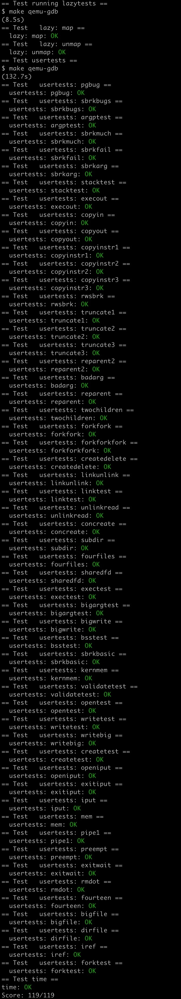

# Lab: xv6 lazy page allocation

https://pdos.csail.mit.edu/6.S081/2020/labs/lazy.html

<br>

许多 OS 都会为用户的堆内存实现懒分配——在用户程序用 sbrk() 申请更多的空间时，不真正开辟物理内存，而是把要用的用户虚拟地址在页表中设为 invalid，等到确实用到了这个虚拟地址，CPU 产生缺页错误，这时内核再分配物理内存。

可以看到，完成这次实验需要我们综合运用前两次实验（page tables，traps）的知识，但只要前两次实验认真做了，这次实验应该不难。


## Eliminate allocation from sbrk()

任务：在 sys_sbrk (kernel/sysproc.c) 中修改 xv6 原本的 sbrk(n) 系统调用的实现。原本的 sbrk(n) 会让用户空间增长 n 个字节，返回新分配虚拟空间的首地址（即原用户空间大小）。新的 sbrk(n) 应该只给 `myproc()->sz` 加上 n，返回原用户空间大小，但是并没有实际开辟物理内存。

根据指导，注释掉 growproc 的调用，改变 sz 即可：

```c
uint64
sys_sbrk(void)
{
  ...
  addr = myproc()->sz;
  myproc()->sz += n;
//  if(growproc(n) < 0)
//    return -1;
  return addr;
}
```

现在编译 xv6，输入 `echo hi`，则会出错：

```
$ echo hi
usertrap(): unexpected scause 0x000000000000000f pid=3
            sepc=0x00000000000012ac stval=0x0000000000004008
panic: uvmunmap: not mapped
```


## Lazy allocation

任务：改变 trap.c 的代码以回应用户空间的缺页错误，即新开辟一页的物理内存空间，返回用户空间继续执行。

我们首先在 usertrap 中处理缺页错误。缺页错误的代码是 13 或 15，当发生缺页错误时，判断是否是懒分配引起的（引起错误的地址在 p->sz 内），如果是，则用 kalloc 新开辟一页物理空间，并在页表中加上缺页的地址所在页面这一项。

```c
void
usertrap(void)
{
  ...
  } else {
    uint64 cause = r_scause();
    if(cause == 13 || cause == 15){
      // page fault
      uint64 stval = r_stval();
      if(stval < p->sz){
        // need lazy allocation
        char *mem = kalloc();
        if(mem){
          memset(mem, 0, PGSIZE);
          if(mappages(p->pagetable, PGROUNDDOWN(stval), PGSIZE, (uint64)mem, PTE_W|PTE_X|PTE_R|PTE_U) != 0){
            kfree(mem);
            uvmunmap(p->pagetable, PGROUNDDOWN(stval), 1, 1);
          } else goto brk;
        }
      }
    }

    printf("usertrap(): unexpected scause %p pid=%d\n", r_scause(), p->pid);
    printf("            sepc=%p stval=%p\n", r_sepc(), r_stval());
    p->killed = 1;
  }
brk:
```

我们还需要更改 uvmunmap 的内容，这是因为加入懒分配之后，uvmunmap 可能会被要求解除本就不存在的映射、或者去找还没有创建的 pte。在原本的写法中这样会 panic，因此，我们要把 panic 改掉：

```c
void
uvmunmap(pagetable_t pagetable, uint64 va, uint64 npages, int do_free)
{
  ...
    if((pte = walk(pagetable, a, 0)) == 0)
      continue; // panic("uvmunmap: walk");
    if((*pte & PTE_V) == 0)
      continue; // panic("uvmunmap: not mapped");
  ...
}
```

现在我们已经能正常执行 `echo hi` 了。


## Lazytests and Usertests

任务：通过 Lazytests 和 Usertests。

完成上一小节的任务后，我们的代码其实并不完善，还需要处理下列问题：

1. 处理负的 sbrk() 参数
2. 如果导致缺页错误的虚拟地址高于任何 sbrk() 分配的内存地址，则杀死进程
3. 在 fork() 中正确处理父进程到子进程的内存复制
4. 处理以下情况：一个进程给系统调用（如 read / write）传入了一个合法的地址，但是地址的内存还没有分配
5. 正确处理超出内存的情况：如果 kalloc() 在缺页错误处理中失败了，则杀死进程
6. 处理缺页错误中访问用户栈之下的非法空间

对于第 1 点，只需要参照 growproc 原本的写法，如果 n < 0，则调用 uvmdealloc 回收空间：

```c
uint64
sys_sbrk(void)
{
  ...
  struct proc *p = myproc();
  addr = p->sz;
  if(n > 0)
    p->sz += n;
  else
    p->sz = uvmdealloc(p->pagetable, addr, addr+n);
  return addr;
}
```

对于第 2、5、6 点，只需要在上一小节的基础上加一点判断和 killed 设置即可，为了方便，这次把处理代码写成一个函数（kernel/proc.c 中）：

```c
// Handle page fault with lazy allocation
int
lazy_allocate(uint64 va){
  struct proc *p = myproc();
  if(va >= p->sz || va < p->trapframe->sp)
    return -1;
  char *mem = kalloc();
  if(mem == 0)
    return -1;
  memset(mem, 0, PGSIZE);
  if(mappages(p->pagetable, PGROUNDDOWN(va), PGSIZE, (uint64)mem, PTE_W|PTE_X|PTE_R|PTE_U) != 0){
    kfree(mem);
    uvmunmap(p->pagetable, PGROUNDDOWN(va), 1, 1);
    return -1;
  }
  return 0;
}
```

于是乎，在 usertrap 中我们只需要调用 lazy_allocate：

```c
void
usertrap(void)
{
  ...
  } else {
    uint64 cause = r_scause();
    if(cause == 13 || cause == 15){
      // page fault
      uint64 stval = r_stval();
      if(lazy_allocate(stval) == 0)
        goto brk;
    }
    printf("usertrap(): unexpected scause %p pid=%d\n", r_scause(), p->pid);
    printf("            sepc=%p stval=%p\n", r_sepc(), r_stval());
    p->killed = 1;
  }
brk:
```

对于第 3 点，我们查看 fork 的代码，发现内存复制是调用 uvmcopy 实现的，所以只需要像改 uvmunmap 一般改 uvmcopy 即可：

```c
int
uvmcopy(pagetable_t old, pagetable_t new, uint64 sz)
{
  ...
  for(i = 0; i < sz; i += PGSIZE){
    if((pte = walk(old, i, 0)) == 0)
      continue; // panic("uvmcopy: pte should exist");
    if((*pte & PTE_V) == 0)
      continue; // panic("uvmcopy: page not present");
  ...
}
```

对于第 4 点，系统调用的时候 RISC-V 硬件不会引发缺页错误，因此操作系统必须处理这种情况。我们知道，那些参数包含地址的系统调用都会执行 argaddr() 函数，所以我们先找到它（kernel/syscall.c）。理论上，在这里处理缺页是可行的，但是我们把目光向上移，就会发现注释说：argaddr() 不检查是否合法，因为 copyin/copyout 会检查。好吧，那我们就去看看 copyin/copyout 是怎么检查的呗。看了一圈下来，我们可以发现，它们会调用 walkaddr()，如果 walkaddr 返回 0，那么就返回错误代码 -1。所以，**本质上是 walkaddr() 在检查是否合法！**Okay，定位了问题所在，我们只需要用上刚刚写的 lazy_allocate() 函数，略微修改 walkaddr() 即可：

```c
uint64
walkaddr(pagetable_t pagetable, uint64 va)
{
  ...
  pte = walk(pagetable, va, 0);
  if(pte == 0 || (*pte & PTE_V) == 0){
    if(lazy_allocate(va) != 0)
      return 0;
    pte = walk(pagetable, va, 0);
  }
  ...
}
```

make grade 截图：


