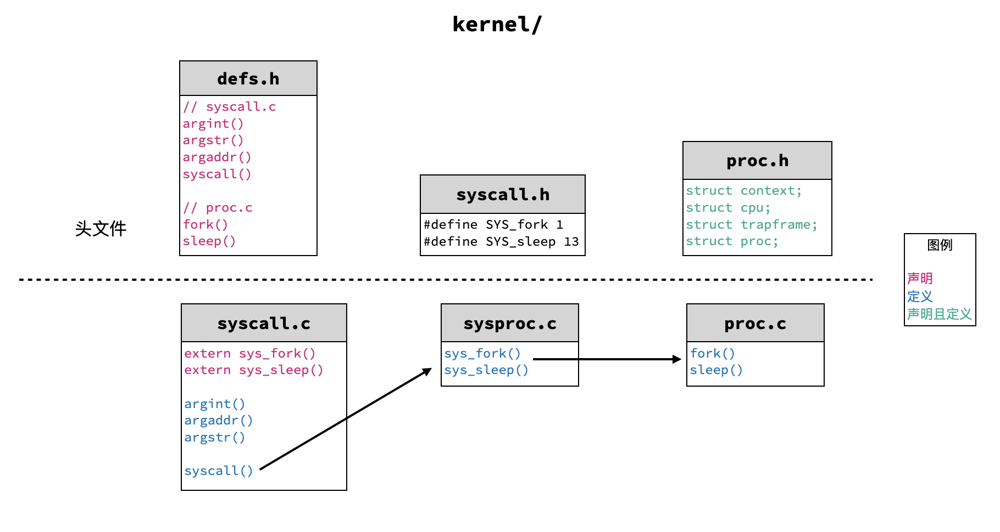

# Lab: system calls

https://pdos.csail.mit.edu/6.S081/2020/labs/syscall.html

<br>

## System call tracing

任务：添加一个系统调用 trace，它接受一个整型参数 mask，mask 是一个二进制掩码，其每一位代表是否跟踪那一位表示的系统调用。例如 fork 是 1 号，那么 mask 的第 1 位就表示是否跟踪 fork。每一种系统调用的编号定义在 kernel/syscall.h 中。如果某一种系统调用被跟踪了，那么在它将要返回的时候，输出一行 `<pid>: systemcall <syscall name> -> <return value>`。trace 能跟踪的进程包括调用它的那个进程，以及该进程所 fork 的子进程、子进程所 fork 的子子进程……

xv6 已经实现了一个 trace.c 用户程序，如果我们添加好了 trace 系统调用，那么这个用户程序就能正常的执行。（回顾一下，在上一个实验中，我们需要写一个**用户程序 sleep**，它调用**系统调用 sleep**；这个实验正好反过来，我们需要写一个**系统调用 trace**，供**用户程序 trace** 调用。）

现在我们需要好好研究一下 xv6 系统（基于 risc-v）究竟是如何完成系统调用的。【理了半天只总结了下面这些，如果有错误还请指出】

不妨假设我们写了一个用户程序 sleep.c 并运行之，于是 CPU 开始「取指-译码-执行-访存-写回」（梦回计组）。跑着跑着，CPU 发现需要执行系统调用 sleep 了，于是将对应的编号（sleep 是 13 号，见 kernel/syscall.h）传入 a7 寄存器，并且调用 ecall 汇编指令（见 user/usys.S）使得进程陷入内核态（supervised mode）。这之后会发生一些事情，我们不管（其实是我看不懂），只需要知道系统调用编号从 a7 寄存器被捞了出来，存储到了 p->trapframe->a7 之中（p 是指向当前进程 pcb 的指针），然后执行 syscall （见 kernel/syscall.c）。syscall 就是一个高层封装，它会根据 p->trapframe->a7 存储的编号，然后找到对应系统调用的处理函数 sys_sleep，而 sys_sleep 还是一层封装……sys_sleep（见 kernel/sysproc.c）会从 p->trapframe->a0 中捞出 sleep 的参数，然后终于真真正正地跑确实让进程等待的 sleep 函数了（见 kernel/proc.c），最后把返回值放进 p->trapframe->a0 之中。

整理一下这个过程：

1. 我们自己写的**用户程序 sleep.c**，它运行在用户态中，调用了**系统调用 sleep**；
2. **系统调用 sleep** 的编号 13 和它的参数在系统中被辗转腾挪，最后从用户态挪到了内核可以操纵的 p->trapframe 中；
3. syscall 作为高层封装解析系统调用编号 13，发现是 sleep，于是调用 **sys_sleep**；
4. **sys_sleep** 拿出参数，调用 kernel/proc.c 中 **sleep()** 函数；
5. kernel/proc.c 中的这个 **sleep()** 函数才完成了实打实的、真正涉及到实现的功能。

好了，现在要实现 trace 系统调用，怎么办呢？

1. 最核心的一点是要意识到，trace 的功能是针对进程而言的，也就是说，trace 可以看成给进程打的一个标签，甚至可以看成进程具有的一个属性。所以，我们可以在 proc 结构体（kernel/proc.h），也就是 pcb 中直接加上 mask，表示当前进程的哪些系统调用被跟踪了；
2. 然后由于 trace 对子进程具有传递性，所以每次 fork 子进程的时候，都要把这个 mask “标签”传下去，这在 fork 的具体实现（kernel/proc.c）中参照其他信息的复制方式加一行即可；
3. 那 mask 在哪里被赋值的呢？获得参数的地方呗。在哪里获得参数？sys_trace 里面咯，所以参照其他调用写一份 sys_trace，把捞出来的参数赋给 mask 即可；
4. 别忘了，trace 是要输出的。由上文可知，内核中处理系统调用的最高层封装是 syscall，在这一层我们已经可以知道是什么系统调用、系统调用的返回值是什么，这对 trace 的输出已经足够了。所以在 syscall 返回前，我们判断当前系统调用是否被 mask 标记了，如果是，则输出；
5. 剩下的工作就简单了，只是把流程连起来而已，参照其他调用在 kernel/syscall.h、user/user.h、user/usys.pl（用于生成 user/usys.S 的脚本）里面加上 trace 相关部分即可。


## Sysinfo

任务：添加一个系统调用 sysinfo 用于收集系统信息，它接受一个指向 struct sysinfo（见 kernel/sysinfo.h）的指针，内核需要填上这个结构体的两个元素：freemem 表示空闲内存的字节数，nproc 表示 state 不是 UNUSED 的进程的数量。

在做了第一个任务之后，这个任务显得简单了许多，不过在码之前，先理一下 kernel 中各个文件之间的关系，因为着实有些混乱，如下图所示（以 fork 和 sleep 为例）：



1. 柿子先挑软的捏，我们先把系统调用这条路打通，和之前一样，参照其他调用在 user/user.h、user/usys.pl、kernel/syscall.h、kernel/syscall.c 中补上 sysinfo；这一步完成了就能够正常编译了；

2. 接下来我们在 kernel/sysproc.c 中实现一个 sys_sysinfo() 函数，这个函数获取指向 struct sysinfo 的指针，求出当前系统空闲内存、非 UNUSED 进程数量，存进这个指针指向的结构体中。看起来我们只需要实现两个底层功能——countfreebytes() 和 countproc()……似乎很完美？但是事情没有这么简单！问题在这个指针上，指针是我们传入的参数，指向的是用户空间的虚拟内存，但是 xv6 系统内核中的页表和用户空间中的页表不一样，所以不能直接用这个指针！（事实上，xv6 内核的虚拟内存直接映射到物理内存，但用户空间中虚拟内存是从 0 开始的）。为了解决这个问题，我们需要使用 copyout() 函数，可以参看 sys_fstat()（kernel/sysfile.c）和 filestat()（kernel/file.c）的实现。综上，我们的 sysproc.c 长这样：

   ```c
   uint64
   sys_sysinfo(void)
   {
     struct proc *p = myproc();
     uint64 ptr; // pointer to struct sysinfo
     if(argaddr(0, &ptr) < 0)
       return -1;
     struct sysinfo si;
     si.freemem = countfreebytes();
     si.nproc = countproc();
     if(copyout(p->pagetable, ptr, (char *)&si, sizeof(si)) < 0)
       return -1;
     return 0;
   }
   ```

3. 现在实现 countfreebytes()，指导网页提示我们在 kernel/kalloc.c 中实现它。阅读代码可以知道，一页有 4KB (PGSIZE)，空闲的页首构成一个链表 kmem.freelist，所以要求出空闲内存的字节数，数一数链表有多长即可：

   ```c
   // Count number of bytes of free memory
   int
   countfreebytes(void)
   {
     int cnt = 0;
     struct run *r = kmem.freelist;
     for(; r; r = r->next)
       cnt += PGSIZE;
     return cnt;
   }
   ```

4.  最后实现 countproc()，指导网页提示我们在 kernel/proc.c 中实现它。阅读代码并且参照其他函数，知道我们可以用一个 for 循环遍历所有进程，数一数这里面有多少个不是 UNUSED 即可：

   ```c
   // Count number of processes whose state is not UNUSED.
   int
   countproc(void)
   {
     int cnt = 0;
     struct proc *p;
     for(p = proc; p < &proc[NPROC]; p++){
       acquire(&p->lock);
       cnt += (p->state != UNUSED);
       release(&p->lock);
     }
     return cnt;
   }
   ```

