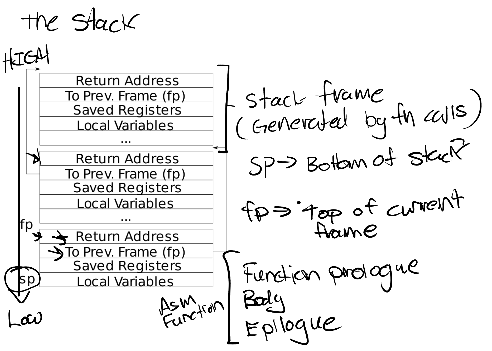
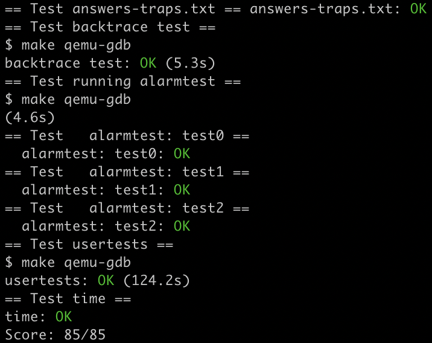

# Lab: traps

https://pdos.csail.mit.edu/6.S081/2020/labs/traps.html


## RISC-V assembly

我们计算机组成原理课上学过 RISC-V 的汇编语言，所以这一节相对轻松。

1. Which registers contain arguments to functions? For example, which register holds 13 in main's call to `printf`?

   user/call.asm 中有两行 `li a2,13` 和 `li a1,12`，我们可以看出 `a1,a2` 寄存器是存放 `printf` 的参数的地方。

2. Where is the call to function `f` in the assembly code for main? Where is the call to `g`? (Hint: the compiler may inline functions.)

   刚刚我们已经看到，`li a,12` 直接把 `f(8)+1` 算出来了，所以是编译器内联了它；另外，`f` 函数里面的指令和 `g` 一模一样，说明编译器也内联了它。

3. At what address is the function `printf` located?

   注释写的很清楚了：`0x630`；

   如果没有注释的话也可以算出来，`auipc ra,0x0` 是将当前 pc 给了 ra，即 ra=`0x30`，那么 `jalr 1536(ra)` 能跳到 `printf`，说明其位置是 `0x30+1536=0x630`。

4. What value is in the register `ra` just after the `jalr` to `printf` in `main`?

   `jalr` 会将 pc+4 存储给指定的寄存器，反汇编语句里省略了指定寄存器，是因为默认给 ra，所以 ra=`0x38`。

5. Run the following code.

   ```c
   unsigned int i = 0x00646c72;
   printf("H%x Wo%s", 57616, &i);
   ```

   What is the output? [Here's an ASCII table](http://web.cs.mun.ca/~michael/c/ascii-table.html) that maps bytes to characters.

   The output depends on that fact that the RISC-V is little-endian. If the RISC-V were instead big-endian what would you set `i` to in order to yield the same output? Would you need to change `57616` to a different value?

   [Here's a description of little- and big-endian](http://www.webopedia.com/TERM/b/big_endian.html) and [a more whimsical description](http://www.networksorcery.com/enp/ien/ien137.txt).

   很有意思的一道题。`%x` 是按 16 进制输出，`57616=0xe110`，所以输出的前半段是 `He110`；

   ASCII 码中 0x64 对应 `d`，0x6c 对应 `l`，0x72 对应 `r`，又 RISC-V 小端存储（低地址存 0x72），且 `%s` 从低地址开始读取数据输出，所以会输出 `rld`，于是输出的后半段就是 `World`。

   如果是大端存储，那么 `i=0x726c6400`；但 `57616` 不用改动。

6. In the following code, what is going to be printed after `'y='`? (note: the answer is not a specific value.) Why does this happen?

   ```c
   printf("x=%d y=%d", 3);
   ```

   前面说了，`a2` 寄存器是 `printf` 指令的第 2 个参数，所以应该会输出 a2 寄存器的值。


## Backtrace

任务：在 `kernelprintf.c` 中添加一个 `backtrace()`，用于在出错时输出这之前栈中的函数调用。编译器会在每个栈帧中存入一个帧指针，指向调用者的帧指针。`backtrace()` 应该用这些帧指针来遍历栈并输出每个栈帧的保存的返回地址。

看到题目的时候，我对帧指针这个术语很迷惑，直到我看到了它的缩写 `fp` 才反应过来这是当前函数的栈顶……然后我又对栈帧这个术语很迷惑，于是看了 [lecture notes](https://pdos.csail.mit.edu/6.828/2020/lec/l-riscv-slides.pdf)，哦，原来是当前函数用的这一段栈啊……notes 里面画的很清楚栈里面都有哪些内容：



这些存放 prev frame 的地址可以看成构成了一个链表，所以写 backtrace 遍历这个链表即可。但是终止条件是什么呢？根据提示，xv6 给每个栈分配一页的大小，所以一直把它所在的页跳完了就终止。

```c
void
backtrace(void)
{
  printf("backtrace:\n");
  uint64 fp = r_fp();
  uint64 lim = PGROUNDUP(fp);
  for(; fp < lim; fp = *((uint64 *)(fp-16)))
    printf("%p\n", *((uint64 *)(fp-8)));
}
```


## Alarm

任务：给 xv6 加一个功能——在进程使用CPU时间时定期发出警告。这对于限制 CPU 密集型（计算密集型）进程的占用时间，或对于在计算过程中有其他定期动作的进程可能很有用。更广泛的说，我们将实现一个用户级中断/异常的处理程序。

我们需要添加一个 `sigalarm(interval, handler)` 系统调用。如果一个应用调用了 `sigalarm(n, fn)`，则该应用每耗时 `n` 个 ticks，内核应该使之调用 `fn`，`fn` 返回后该应用继续执行。如果一个应用调用 `sigalarm(0, 0)`，内核应该停止产生 alarm calls。


### test0: invoke handler

这个任务本来是比较难的，但是指导网站写得真的太详细了，跟着指导一步步做就行。我感觉总体思想和 Lab2 的 trace 类似，把总 ticks 数、处理程序指针、剩余 ticks 数存放在 struct proc 中，视为当前进程的「属性」：

```c
struct proc {
  ...
  int ticks;                   // Ticks between two alarms.
  uint64 handler;              // Alarm handler.
  int remain_ticks;            // Remaining ticks after last alarm.
};
```

在 allocproc (kernel/proc.c) 中初始化：

```c
static struct proc*
allocproc(void)
{
  ...
  // Initialize for alarm.
  p->ticks = p->remain_ticks = 0;
  p->handler = 0;
  return p;
}
```

当进程调用 sigalarm 系统调用时设置它们：

```c
uint64
sys_sigalarm(void)
{
  int ticks;
  uint64 handler;
  struct proc *p = myproc();

  if(argint(0, &ticks) < 0)
    return -1;
  if(argaddr(1, &handler) < 0)
    return -1;
  acquire(&p->lock);
  p->ticks = ticks;
  p->handler = handler;
  p->remain_ticks = ticks;
  release(&p->lock);
  return 0;
}
```

每一个 tick 过后硬件都会产生计时器中断（timer interrupt），所以我们在 kernel/trap.c 中 `if(which_dev == 2)` 语句下处理它。一个计时器中断发生后将剩余 ticks 减 1，如果减到 0 了，则在返回用户空间的时候让它返回到处理程序。从 xv6 book 第四章我们可以知道，内核只需要设置 sepc 即可控制返回的地址，这是在 usertrapret() 中执行的：

```c
void
usertrapret(void)
{
  ...
  // set S Exception Program Counter to the saved user pc.
  w_sepc(p->trapframe->epc);
  ...
}
```

所以我们只需要事先把 `p->trapframe->epc` 改成处理程序地址即可：

```c
void
usertrap(void)
{
  ...
  if(p->killed)
    exit(-1);

  // This is a timer interrupt.
  if(which_dev == 2){
    if(p->ticks == 0)
      yield();
    p->remain_ticks--;
    if(p->remain_ticks == 0){
      p->remain_ticks = p->ticks;
      p->trapframe->epc = p->handler; // TODO
    }
  }

  usertrapret();
}
```


### test1/test2(): resume interrupted code

test0 里面我们写的代码显然有问题：`p->trapframe->epc` 被覆盖了且从来没有恢复过。改正方法也很简单：事先复制一份，在 sigreturn 系统调用时恢复它。除了 epc 以外，由于处理程序还有可能更改寄存器，我们还需要保存寄存器，所以不妨直接把整个 trapframe 复制下来：

```c
  // This is a timer interrupt.
  if(which_dev == 2){
    if(p->ticks == 0)
      yield();
    p->remain_ticks--;
    if(p->remain_ticks == 0){
      p->remain_ticks = p->ticks;
      p->save_trapframe = (struct trapframe *)kalloc();
      memmove(p->save_trapframe, p->trapframe, PGSIZE);
      p->trapframe->epc = p->handler;
    }
  }
```

然后在 sigreturn 中还原 trapframe：

```c
uint64
sys_sigreturn(void)
{
  struct proc *p = myproc();
  acquire(&p->lock);
  if(p->save_trapframe){
    memmove(p->trapframe, p->save_trapframe, PGSIZE);
    kfree(p->save_trapframe);
    p->save_trapframe = 0;
  }
  release(&p->lock);
  return 0;
}
```

现在我们能过 test1，但是不能过 test2，原因是我们没有保证：如果一个处理函数尚未返回，那么内核不应该再次调用它。要保证这一点，只需要加上一个判断条件：

```c
  // This is a timer interrupt.
  if(which_dev == 2){
    if(p->ticks == 0)
      yield();
    p->remain_ticks--;
    if(p->remain_ticks == 0 && p->save_trapframe == 0){
      p->remain_ticks = p->ticks;
      p->save_trapframe = (struct trapframe *)kalloc();
      memmove(p->save_trapframe, p->trapframe, PGSIZE);
      p->trapframe->epc = p->handler;
    }
  }
```

make grade 截图：


