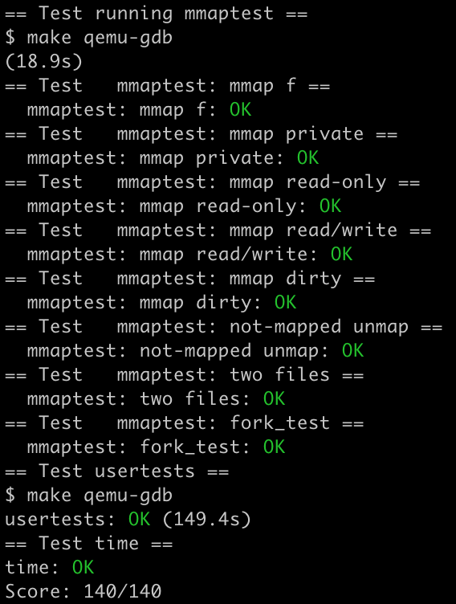

# Lab: file system

https://pdos.csail.mit.edu/6.S081/2020/labs/fs.html

<br>

xv6 文件系统的代码其实还是很繁杂的，大概像下面这样：


所以做实验前很容易一头雾水。但是完成这次实验其实用不着把文件系统的实现细节全搞清楚，理解几个关键点（特别是 inode 就行了）。

inode 是文件系统的核心，看了 mit 网课之后我画了一张图，希望有助于理解：


## Large files

任务：xv6 支持的最大文件大小由 inode 结构体决定——它包含 12 个 direct block number 和 1 个 indirect block number，后者指向的块里面含有 256 个 block number，所以一个文件最大占据 256+12=268 个磁盘块，也就是 268KB。这显然太小了，所以我们希望通过 doubly-indirect block 增大它——在 inode 里面，添加一个 doubly-indirect block（相应地，direct block 减少一个），并更改 bmap() 函数添加新的映射。

indirect 相当于一级索引，doubly-indirect 相当于二级索引，这个树形结构和多级页表很像。总的来说，这个任务很好理解，实现也不难，体现在代码里基本就是依葫芦画瓢和复制粘贴。

仿照 bmap() 中一级索引的查找方式，很容易写出二级索引的查找代码，只需注意 `bn / NINDIRECT` 是第一层的编号，`bn % NINDIRECT` 是第二层的编号：

```c
static uint
bmap(struct inode *ip, uint bn)
{
  uint addr, *a;
  struct buf *bp;

  if(bn < NDIRECT){
      ...
  }
  bn -= NDIRECT;

  if(bn < NINDIRECT){
      ...
  }

  bn -= NINDIRECT;
  if(bn < NINDIRECT2){
    // load doubly-indirect block, allocating if necessary.
    if((addr = ip->addrs[NDIRECT+1]) == 0)
      ip->addrs[NDIRECT+1] = addr = balloc(ip->dev);
    bp = bread(ip->dev, addr);
    a = (uint*)bp->data;
    if((addr = a[bn / NINDIRECT]) == 0){
      a[bn / NINDIRECT] = addr = balloc(ip->dev);
      log_write(bp);
    }
    brelse(bp);
    bp = bread(ip->dev, addr);
    a = (uint*)bp->data;
    if((addr = a[bn % NINDIRECT]) == 0){
      a[bn % NINDIRECT] = addr = balloc(ip->dev);
      log_write(bp);
    }
    brelse(bp);
    return addr;
  }

  panic("bmap: out of range");
}
```

另外还要更改 itrunc() 函数来释放所有块：

```c
void
itrunc(struct inode *ip)
{
  ...

  if(ip->addrs[NDIRECT]){
      ...
  }

  if(ip->addrs[NDIRECT+1]){
    bp = bread(ip->dev, ip->addrs[NDIRECT+1]);
    a = (uint*)bp->data;
    for(j = 0; j < NINDIRECT; j++){
      if(a[j]){
        struct buf *bp2 = bread(ip->dev, a[j]);
        uint *a2 = (uint*)bp2->data;
        for(int k = 0; k < NINDIRECT; k++){
          if(a2[k])
            bfree(ip->dev, a2[k]);
        }
        brelse(bp2);
        bfree(ip->dev, a[j]);
        a[j] = 0;
      }
    }
    brelse(bp);
    bfree(ip->dev, ip->addrs[NDIRECT+1]);
    ip->addrs[NDIRECT+1] = 0;
  }
  ...
```


## Symbolic links

任务：实现 `symlink(char *target, char *path)` 系统调用，它在 `path` 处创建一个到文件名为 `target` 的软链接。

软链接基本可以理解为 Windows 下的快捷方式，它本身也是一个文件，但是指向另一个文件。当打开一个软链接文件时，如果打开模式没有设置 `O_NOFOLLOW`，就会打开链接到的文件——如果链接到的文件也是一个软链接，则继续往下找。

这次任务的核心在于 `sys_symlink（）`——也就是 `symlink` 系统调用的底层实现，和对 `sys_open（`  的改动，至于那些打通系统调用、添加标志位之类的代码就不细说了。

虽然 xv6 文件系统的代码非常繁杂，但是它还是提供了一些友好的接口——比如 `create()`。`create()` 函数定义在 `kernel/sysfile.c` 里，而不是作为文件系统的基本功能定义在 `kernel/fs.c` 里，从这一点就可以看出它的定位就是方便我们写代码。**一个小坑是 `create()` 返回时是上了锁的，所以不要重复上锁。**使用 `create()` 创建位于 `path` 的 symlink 文件之后，我们把 `target` 存到文件的数据块里——因为对于软链接文件来说，`target` 就是它的「数据」。写数据用 `writei()` 函数，接口也非常友好。

```c
uint64
sys_symlink(void)
{
  char target[MAXPATH], path[MAXPATH];
  if(argstr(0, target, MAXPATH) < 0 || argstr(1, path, MAXPATH) < 0)
    return -1;

  begin_op();
  struct inode *ip;
  if((ip = create(path, T_SYMLINK, 0, 0)) == 0){
    end_op();
    return -1;
  }
  if(writei(ip, 0, (uint64)target, 0, MAXPATH) != MAXPATH){
    end_op();
    return -1;
  }
  iupdate(ip);
  iunlockput(ip);
  end_op();
  return 0;
}
```

然后改 `sys_open()`，当取到的文件时软链接并且没有设置 `O_NOFOLLOW` 时，就沿着链接一直往下找。和 `writei()` 对应的，用 `readi()` 读取文件的数据块即可得到链接地址。

```c
uint64
sys_open(void)
{
  ...
  int cnt = 0;
  while(ip->type == T_SYMLINK && !(omode & O_NOFOLLOW)){
    if((n = readi(ip, 0, (uint64)path, 0, MAXPATH)) != MAXPATH){
      iunlockput(ip);
      end_op();
      return -1;
    }
    iunlockput(ip);
    if((ip = namei(path)) == 0 || ++cnt > 10){
      end_op();
      return -1;
    }
    ilock(ip);
  }
  ...
}
```

<br>

make grade 截图：


