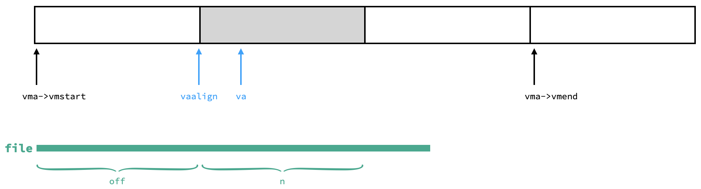

# Lab: mmap

https://pdos.csail.mit.edu/6.S081/2020/labs/mmap.html

<br>

```c
void *mmap(void *addr, size_t length, int prot, int flags, int fd, off_t offset);
int munmap(void *addr, size_t len);
```

本次实验只需实现简化版的 `mmap` 和 `munmap`：

- 保证 `addr` 和 `offset` 都为 0，也即：在虚拟空间中找足够大的连续页面，将 `fd` 对应文件的前 `length` 字节存储在里面。
- `flags` 只需考虑 `MAP_SHARED` 和 `MAP_PRIVATE`；`prot` 只需考虑 `PROT_WRITE` 和 `PROT_READ`。
- 允许不同进程把同一个 `MAP_SHARED` 的文件映射到不同的物理页面上。
- `munmap` 释放的范围保证是一段 mmap 了的空间的开头一段、或结尾一段、或全部，不会从中间挖一个洞出来。

即便做了上述简化，这次实验还是具有相当的难度，好在 mit 也给了很多提示。

<br>

首先设计一个数据结构 VMA，记录 mmap 分配的虚拟内存空间，包括地址、长度、权限等等信息：

```c
struct VMA {
  int shared;
  int perm;
  struct file *filept;
  struct VMA *nxt;
  int valid;
  uint64 vmstart, vmend;
};
```

这里，我并没有直接记录 `mmap` 输入的变量，而是做了一些转换方便后续操作：

- `shared` 为 1 表示 `MAP_SHARED`，为 0 表示 `MAP_PRIVATE`
- `perm` 指示 pte 的权限，即 `PTE_W` 或 `PTE_R` 或二者都有，根据 `prot` 设置
- `filept` 是指向文件的指针，指向当前进程打开的描述符为 `fd` 的文件
- `valid` 指示该 VMA 是否正在被某进程使用中
- `vmstart` 和 `vmend` 是根据 `addr` 和 `length` 计算出来的**与一页对齐**的 vma 地址范围，因为我们分配内存空间一定是按页分配的
- 每一个进程的 PCB 中记录它用到的所有 VMA——我用了一个链表，所以有一个 `nxt` 指针字段

开一个 VMA 全局数组（16 个即可），当某进程执行 mmap 系统调用时就从该数组中找一个 valid 无效的 VMA 分配给该进程：

```c
struct {
  struct spinlock lock;
  struct VMA vmas[NVMA];
} vmatable;

void
vmainit(void)
{
  initlock(&vmatable.lock, "vmatable");
}

struct VMA*
allocvma(void)
{
  acquire(&vmatable.lock);
  int i;
  for(i = 0; i < NVMA; i++){
    if(vmatable.vmas[i].valid)
      continue;
    vmatable.vmas[i].valid = 1;
    break;
  }
  release(&vmatable.lock);
  if(i == NVMA) panic("allocvma");
  return vmatable.vmas + i;
}

void
deallocvma(struct VMA *vma)
{
  acquire(&vmatable.lock);
  vma->valid = 0;
  release(&vmatable.lock);
}
```

给多个进程分配 vma 显然是需要上锁的操作，我懒得麻烦就直接上全局锁了。

<br>

把 mmap 和 munmap 系统调用的路径打通就不说了，现在考虑 `sys_mmap` 的实现。首先分配一个 vma，按照上文所述含义填充 vma 的各个字段，注意要增加文件的 reference count，然后把这个 vma 加到进程的 vma 链表里面。`mmap` 是 lazy allocation 的，所以我们这时候无需 kalloc 物理内存，只需返回起始地址。根据指导网站的描述，我们要「在进程的地址空间中找到一块不用的区域来映射文件」，这句话说的就非常玄学了。我参考了 https://xiayingp.gitbook.io/build_a_os/labs/untitled#define-vma-virtual-memory-area-per-process 的做法，从高地址处向低地址找这样的“不用区域”，为此在每个 PCB 里记录一下已分配区域的最低地址 curmax，下次就从 curmax 继续往下分配。

```c
uint64
sys_mmap(void)
{
  uint64 addr;
  int length, prot, flags, fd, offset;
  struct proc *p = myproc();

  if(argaddr(0, &addr) < 0 ||
     argint(1, &length) < 0 ||
     argint(2, &prot) < 0 ||
     argint(3, &flags) < 0 ||
     argint(4, &fd) < 0 ||
     argint(5, &offset) < 0)
    return -1;
  if(addr != 0) panic("sys_mmap");
  if(offset != 0) panic("sys_mmap");
  
  struct file *f = p->ofile[fd];
  if((prot & PROT_READ) && !f->readable)
    return -1;
  if((prot & PROT_WRITE) && (flags & MAP_SHARED) && !f->writable)
    return -1;

  // alloc a vma
  struct VMA *vma = allocvma();
  if(!vma)  return -1;
  // fill in vma
  vma->perm = ((prot & PROT_READ) ? PTE_R : 0) |
              ((prot & PROT_WRITE) ? PTE_W : 0);
  vma->shared = (flags & MAP_SHARED) ? 1 : 0;
  vma->filept = f;
  filedup(f);
  // add vma to process's linklist
  vma->nxt = p->vmalist;
  p->vmalist = vma;
  // find an unused region in the process's address space in which to map the file
  uint64 vmaddr = PGROUNDDOWN(p->curmax - length);
  if(vmaddr % PGSIZE != 0)  panic("sys_mmap");
  vma->vmstart = vmaddr;
  vma->vmend = p->curmax;
  p->curmax = vmaddr;

  return vmaddr;
}
```

<br>

如前所述，`mmap` 是 lazy allocation 的，所以我们在 usertrap 里处理 page fault：

```c
void
usertrap(void)
{
  ...
  if(r_scause() == 8){
    ...
  } else if((which_dev = devintr()) != 0){
    ...
  } else {
    uint64 cause = r_scause();
    if(cause == 13 || cause == 15){
      // page fault
      uint64 stval = r_stval();
      if(mmaplazy(stval, cause) == 0)
        goto brk;
    }
    printf("usertrap(): unexpected scause %p pid=%d\n", r_scause(), p->pid);
    printf("            sepc=%p stval=%p\n", r_sepc(), r_stval());
    p->killed = 1;
  }
brk:
  ...
}
```

`stval` 就是产生 page fault 的地址，我们不需要读入整个文件，只需要申请并映射 `stval` 所在的那一页并读入这一页对应的文件数据即可：

```c
int
mmaplazy(uint64 va, uint64 cause)
{
  struct proc *p = myproc();
  // find the corresponding vma
  struct VMA *vma = 0;
  for(vma = p->vmalist; vma; vma = vma->nxt)
    if(vma->valid && vma->vmstart <= va && va < vma->vmend)
      break;
  if(!vma)  return -1;
  if(cause == 13 && !(vma->perm & PTE_R)) return -1;
  if(cause == 15 && !(vma->perm & PTE_W)) return -1;
  // allocate physical memory and map pte
  char *mem = kalloc();
  if(mem == 0)  return -1;
  memset(mem, 0, PGSIZE);
  uint64 vaalign = PGROUNDDOWN(va);
  if(mappages(p->pagetable, vaalign, PGSIZE, (uint64)mem, vma->perm|PTE_U|PTE_X) != 0){
    kfree(mem);
    return -1;
  }
  // read content of file into allocated memory
  mmapfileread(vma->filept, 0, (uint64)mem, vaalign - vma->vmstart, PGSIZE);
  return 0;
}

int mmapfileread(struct file *f, int user_dst, uint64 dst, uint off, uint n){ 
  ilock(f->ip);
  int ret = readi(f->ip, user_dst, dst, off, n);
  iunlock(f->ip);
  return ret;
}
```

这里特别说明文件开始读的偏移位置 `off` 和读的长度 `n` 是怎么计算的，如图所示：



蓝色 `va` 是发生 pagefault 的地方，因此灰色页就是我们要读的页。绿色线段是文件占的大小，它一定从 `vmstart` 开始。从图上能直观的看出，我们要读的文件偏移量就是 `vaalign-vmstart`，又由于读一页，所以 n 就是 `PGSIZE`。

<br>

munmap 的时候干这么几件事：

1. 找到包含释放空间的 vma
2. 如果 vma 是 shared 的，则把现在的内容写回文件
3. 解除页表的映射
4. 分情况更新 vma：如果释放的只是 vma 区域的一部分，则更新 vma 的 `vmstart` 和 `vmend`；如果释放了整个 vma 区域，则把它从链表里拿出来、释放（valid 置零）、减少文件 reference count。

```c
uint64
sys_munmap(void)
{
  uint64 addr;
  int length;
  struct proc *p = myproc();

  if(argaddr(0, &addr) < 0 || argint(1, &length) < 0)
    return -1;

  // find the VMA for the address range
  uint64 st = PGROUNDDOWN(addr);
  uint64 ed = PGROUNDUP(addr + length);
  struct VMA *vma = 0, *pre = 0;
  for(vma = p->vmalist; vma; vma = vma->nxt){
    if(vma->valid && vma->vmstart <= st && ed <= vma->vmend)
      break;
    pre = vma;
  }
  if(!vma)  return -1;

  // write back if needed
  if(vma->shared && (vma->perm | PTE_W))
    mmapfilewrite(vma->filept, st, ed - st);
  // unmap specified pages
  for(uint64 i = st; i < ed; i += PGSIZE){
    if(walkaddr(p->pagetable, i)){
      // need to check because vma is allocated lazily
      uvmunmap(p->pagetable, i, 1, 1);
    }
  }
  // update info in vma
  if(vma->vmstart == st && ed < vma->vmend)
    vma->vmstart = PGROUNDDOWN(addr + length);
  else if(vma->vmstart < st && ed == vma->vmend)
    vma->vmend = PGROUNDUP(addr);
  else if(vma->vmstart == st && ed == vma->vmend){
    if(pre == 0)  p->vmalist = vma->nxt;
    else  pre->nxt = vma->nxt, vma->nxt = 0;
    fileclose(vma->filept);
    deallocvma(vma);
  }
  else ;

  return 0;
}
```

值得注意的是，解除页表映射前一定先 walk 一下，因为我们是 lazy allocation，释放空间里的页面不一定全部都已经建立了映射。

还有一个点，如果释放区域是 vma 开头或者结尾区域，那怎么调整 `vmstart` 或 `vmend` 呢？看图说话：


理论上来说，释放了 vma 一部分后，这部分空间可以拿出来再次分配（垃圾回收），或者可以进行内存紧缩。我并没有实现它们，这是可以继续改进的一点。

<br>

最后，在 `exit` 中释放掉该进程的所有 vma，要干的事和 munmap 差不多：

```c
void
exit(int status)
{
  ...
  struct VMA *vma = 0, *nxtvma = 0;
  for(vma = p->vmalist; vma; vma = nxtvma){
    nxtvma = vma->nxt;
    for(uint64 i = vma->vmstart; i < vma->vmend; i += PGSIZE)
      if(walkaddr(p->pagetable, i))
        uvmunmap(p->pagetable, i, 1, 1);
    vma->nxt = 0;
    fileclose(vma->filept);
    deallocvma(vma);
  }
  p->vmalist = 0;
  ...
}
```

以及在 `fork` 的时候把 vma 给到子进程，要干的事和 mmap 差不多：

```c
int
fork(void)
{
  ...
  struct VMA *vma = 0, *pre = 0;
  np->vmalist = 0;
  for(vma = p->vmalist; vma; vma = vma->nxt){
    // alloc a vma
    struct VMA *newvma = allocvma();
    // fill in newvma
    newvma->shared = vma->shared;
    newvma->perm = vma->perm;
    newvma->filept = vma->filept;
    newvma->vmstart = vma->vmstart;
    newvma->vmend = vma->vmend;
    filedup(vma->filept);
    // add newvma to np's linklist
    if(pre == 0)  np->vmalist = newvma;
    else  pre->nxt = newvma, newvma->nxt = 0;
    pre = newvma;
  }
}
```

<br>

make grade 截图：


