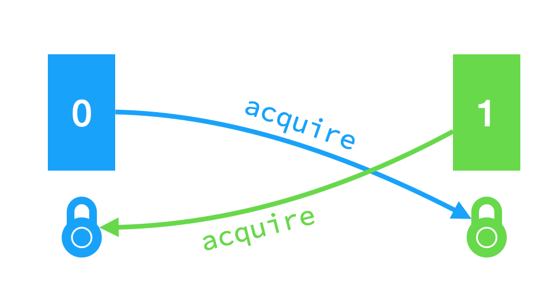

# Lab: locks

https://pdos.csail.mit.edu/6.S081/2020/labs/lock.html

<br>

这次实验中我们将重新设计 xv6 的**内存分配**和**磁盘块缓存**机制以提高它们的并行性。并行性的性能可以由锁争用的次数反应出来——差的并行代码会导致高锁争用。


## Memory allocator

任务：原本的 kalloc.c 导致高锁争用的原因是 xv6 只维护了一个空闲页面链表，该链表有一个锁。为了减少锁争用，我们可以给每一个 CPU 维护一个空闲页面链表，这样不同 CPU 就可以并行地内存分配和释放，因为它们之间相互独立。但是，当一个 CPU 的空闲页面被分配完之后，它需要从其他的 CPU 的空闲页面链表中**窃取**一部分空闲页面。窃取过程可能导致锁争用，但是不会很频繁。

我们的任务就是实现每一个 CPU 一个空闲链表，且在链表为空时窃取页面。所有锁的名字必须以 kmem 开头。kalloctest 检测是否减少了锁争用，usertests sbrkmuch 检测是否仍然能够分配所有内存。

首先把原来的一个 kmem 结构体改成一个数组 kmems，使每个 CPU 有一个对应的空闲页面链表：

```c
struct kmem{
  struct spinlock lock;
  struct run *freelist;
} kmems[NCPU];
```

然后每个 CPU 分别初始化：

```c
void
kinit()
{
  for(int i = 0; i < NCPU; i++){
    initlock(&kmems[i].lock, "kmem");
    freerange(i == 0 ? end : (void*)PHYSTOP, (void*)PHYSTOP);
  }
  /*initlock(&kmem.lock, "kmem");
  freerange(end, (void*)PHYSTOP);*/
}
```

这里我偷了个懒，先给 0 号 CPU 分配所有内存，其他 CPU 不分配。由于一个 CPU 没有空闲页面时会去其他 CPU 处窃取，所以我希望足够长时间之后，页面能够大致平均分配开（这其实是一个数学问题……有时间可以研究一下……）。

kfree 把释放的页面放进**当前 CPU** 的空闲页面链表。

```c
void
kfree(void *pa)
{
  ...
  r = (struct run*)pa;
  push_off(); int ci = cpuid(); pop_off();
  acquire(&kmems[ci].lock);
  r->next = kmems[ci].freelist;
  kmems[ci].freelist = r;
  release(&kmems[ci].lock);
}
```

kalloc 从当前 CPU 空闲页面链表中取一个页面，如果不存在则窃取（steal）：

```c
void *
kalloc(void)
{
  struct run *r;
  ...
  push_off(); int ci = cpuid(); pop_off();
  acquire(&kmems[ci].lock);
  r = kmems[ci].freelist;
  if(r)
    kmems[ci].freelist = r->next;
  else // Steal from other CPU when freelist is empty.
    r = steal(ci);
  release(&kmems[ci].lock);
  ...
}
```

窃取我实现的很暴力，逐一检查各个 CPU 是否有空闲页面，有就窃取过来：

```c
struct run *
steal(int ci)
{
  struct run *r = 0;
  for(int i = 0; i < NCPU; i++){
    if(i == ci) continue;
    acquire(&kmems[i].lock);
    if((r = kmems[i].freelist)){
      kmems[i].freelist = r->next;
      release(&kmems[i].lock);
      break;
    }
    release(&kmems[i].lock);
  }
  return r;
}
```


## Buffer cache

xv6 在 bio.c 中实现了磁盘块的缓存机制，它是一个双向链表，每个元素是一个缓存块。一个缓存块（struct buf, kernel/buf.h）不仅包含数据，还包含有效位 valid、脏位 disk、设备号、磁盘块号、被引用次数等信息。**整个双向链表由一个自旋锁保护，每个缓存块都由一个睡眠锁保护。**

任务：由于整个缓存双向链表由一个自旋锁保护，所以多个进程反复读不同文件时会产生高锁争用。我们要更改缓存机制以减少锁争用。

我选择的方法是 Hash：原本只有一个双向链表维护所有缓存块，现在我开 NBUCKETS 个桶，每个桶里面维护一个双向链表。一个块应该去哪个桶里找由 Hash 确定。

Hash 函数是最简单的直接取模：

```c
#define NBUCKETS 13
inline uint myhash(uint blockno){
  return blockno % NBUCKETS;
}
```

<br>

然后修改 binit 给每个桶初始化：

```c
void
binit(void)
{
  struct buf *b;
  for(int i = 0; i < NBUCKETS; i++){
    initlock(&bcache.lock[i], "bcache");
    // Create linked list of buffers
    bcache.head[i].prev = &bcache.head[i];
    bcache.head[i].next = &bcache.head[i];
  }
  for(b = bcache.buf; b < bcache.buf+NBUF; b++){
    b->next = bcache.head[0].next;
    b->prev = &bcache.head[0];
    initsleeplock(&b->lock, "buffer");
    bcache.head[0].next->prev = b;
    bcache.head[0].next = b;
  }
}
```

和 kinit 一样我偷了个懒，先把所有缓存块给 0 号桶，因为当一个桶缓存块不够用时会去其他桶窃取。

<br>

接下来修改 bget。原本的 bget 在双向链表中**扫描两次**，第一次**从前往后**找是否命中，如果命中则返回命中的缓存块；如果没命中，则第二次**从后往前**找一块未被映射的缓存块（refcnt = 0），加上映射之后返回之。这样扫描实现了 LRU 机制。

为了修改，我们除了把上述双向链表改成当前桶的双向链表以外，还需处理一种情况：如果当前桶没有空闲的缓存块，那么去其他桶窃取一块。为了方便，我把「从某桶取出某未映射缓存」写作如下函数：

```c
// Extract and return available cache block from bucket b.
struct buf *
bfind(int i, int needlock){
  if(needlock)
    acquire(&bcache.lock[i]);
  for(struct buf *b = bcache.head[i].prev; b != &bcache.head[i]; b = b->prev){
    if(b->refcnt == 0){
      b->prev->next = b->next;
      b->next->prev = b->prev;
      b->prev = b->next = 0;
      if(needlock)
        release(&bcache.lock[i]);
      return b;
    }
  }
  if(needlock)
    release(&bcache.lock[i]);
  return 0;
}
```

在 bget 中，先对当前桶执行 bfind，如果没找到则窃取——遍历其他桶执行 bfind，把返回的缓存块插入当前桶的双向链表。有一个坑是：如果 bfind 的是当前桶，小心不要重复上锁。

然后本实验最难的点来了：**窃取过程可能发生死锁**。

假设每个桶在窃取别人时都是从 0 号桶开始遍历，那么考虑如下情况：



0 号桶和 1 号桶都先执行 bget，把自己锁住；然后 0 号桶找 1 号桶要空闲块，于是申请 1 号桶的锁；1 号桶找 0 号桶要空闲块，于是申请 0 号桶的锁——这样就死锁了。但这时系统的 2 号桶可能有空闲块是可以给出来的。

要解决这个问题，我和同学经过了漫长的讨论，目前有两种方案。但是，**panic 或者死锁很难很难很难很难复现，所以我也没法保证下述策略一定正确……**


### 方案一：更改遍历顺序

i 号桶在窃取时从 i+1 开始向后遍历，直到绕一圈回来。其实这样做也可能死锁，但是死锁的唯一情形是——当前没有任何桶有空闲块，这样的情形下 xv6 原本的策略是 panic，不比死锁好哪儿去。

```c
static struct buf*
bget(uint dev, uint blockno)
{
  struct buf *b;

  uint hashid = myhash(blockno);
  acquire(&bcache.lock[hashid]);

  // Is the block already cached?
  for(b = bcache.head[hashid].next; b != &bcache.head[hashid]; b = b->next){
    if(b->dev == dev && b->blockno == blockno){
      b->refcnt++;
      release(&bcache.lock[hashid]);
      acquiresleep(&b->lock);
      return b;
    }
  }

  // Not cached.
  // Recycle the least recently used (LRU) unused buffer.
  b = bfind(hashid, 0);
  if(!b)
    for(int i = (hashid + 1) % NBUCKETS; i != hashid; i = (i + 1) % NBUCKETS)
      if((b = bfind(i, 1)))  break;
  if(b){
    b->next = bcache.head[hashid].next;
    b->prev = &bcache.head[hashid];
    bcache.head[hashid].next->prev = b;
    bcache.head[hashid].next = b;

    b->dev = dev;
    b->blockno = blockno;
    b->valid = 0;
    b->refcnt = 1;
    release(&bcache.lock[hashid]);
    acquiresleep(&b->lock);
    return b;
  }
  panic("bget: no buffers");
}
```


### 方案二：加全局锁

仔细思考死锁什么时候会发生：当我窃取别人时，别人也在窃取我。但是，我去窃取别人这个动作本身就说明了我自己都一贫如洗不能自给自足，别人还来窃取我，那必然是徒劳无功的。所以，如果我现在放开自己的锁，打开家门让别人来自己的桶里逛一圈，别人也拿不走什么东西。所以我们有了初步的解决方案：在窃取别人前释放自己的锁。

然而，当我们兴致勃勃地写完代码运行测试的时候，就会发现 `panic freeing free block`。

panic 的原因是我们没有保证 bget 的原子性，使得两个进程将同一个磁盘块做了两次缓存——在进程 1 释放锁之后，进程 2 也去访问同一个磁盘块，于是两个进程各自偷了一块缓存块，都对磁盘块做了缓存。由于这样很容易导致两个缓存不一致，因此是不被允许的。

要解决（缓解）这个问题，考虑引入全局锁——即对整个 bcache 上锁。假若一个进程在释放某桶的锁之后，能立即加上全局锁，就可以避免另一个进程来找同一个磁盘块。

但毕竟我们没法保证释放桶锁和加全局锁这两个操作是原子的，如果有个进程好巧不巧（概率很小）在这两个操作之间来查找同一个磁盘块，仍然会 panic。所以这种做法能够极大的缓解 panic 问题，但并没有根本上解决它。

针对重复缓存的问题，我想了个办法：在窃取到缓存块之后，先在桶里再次查找一番是否有已映射的缓存块，如果有，就不映射窃取来的缓存块了。好比我出门走了一趟，回来发现已经有人往我家里放了我要的东西。

```c
static struct buf*
bget(uint dev, uint blockno)
{
  struct buf *b;

  uint hashid = myhash(blockno);
  acquire(&bcache.buclock[hashid]);

  // Is the block already cached?
  for(b = bcache.head[hashid].next; b != &bcache.head[hashid]; b = b->next){
    if(b->dev == dev && b->blockno == blockno){
      b->refcnt++;
      release(&bcache.buclock[hashid]);
      acquiresleep(&b->lock);
      return b;
    }
  }

  // Not cached.
  // Recycle the least recently used (LRU) unused buffer.
  b = bfind(hashid, 0);
  if(!b){
    release(&bcache.buclock[hashid]);
    acquire(&bcache.lock);
    for(int i = 0; i < NBUCKETS; i++)
      if(i != hashid && (b = bfind(i, 1)))  break;
    release(&bcache.lock);
    acquire(&bcache.buclock[hashid]);
  }
  if(b){
    b->next = bcache.head[hashid].next;
    b->prev = &bcache.head[hashid];
    bcache.head[hashid].next->prev = b;
    bcache.head[hashid].next = b;
  }
  for(struct buf *bi = bcache.head[hashid].next; bi != &bcache.head[hashid]; bi = bi->next){
    if(bi->dev == dev && bi->blockno == blockno){
      bi->refcnt++;
      release(&bcache.buclock[hashid]);
      acquiresleep(&bi->lock);
      return bi;
    }
  }
  if(b){
    b->dev = dev;
    b->blockno = blockno;
    b->valid = 0;
    b->refcnt = 1;
    release(&bcache.buclock[hashid]);
    acquiresleep(&b->lock);
    return b;
  }
  panic("bget: no buffers");
}
```

我强调这种办法只是为了解决重复缓存的问题，但是会不会导致其他问题嘛……我也不敢保证……

<br>

brelse、bpin、bunpin 都只需要把原来的锁换成当前桶的锁即可，这里不再赘述。

<br>make grade 截图：


